# Alison.com Platform Analytics Report

**Subtitle:** A strategic analysis of catalog health, learner behavior, and growth levers across 5,734 courses, 73.9M enrollments, and 446 publishers — with a 15.6% platform-wide certification rate.

---

## Executive Summary

Alison operates one of the world's largest free learning platforms, but this analysis reveals a consistent tension between what the platform offers and what learners actually want. Business courses dominate the catalog yet still fall short of demand; healthcare and personal development punch above their weight in converting enrollments to certifications; and premium courses — despite their designation — underperform standard courses in every retention metric. The platform has clear structural strengths in workplace-oriented learning and a core of high-efficiency publishers, but a broken rating system, a widespread dropout problem, and a counterintuitive content format story all point to actionable opportunities for improvement.

---

## 1. Category Supply vs Demand

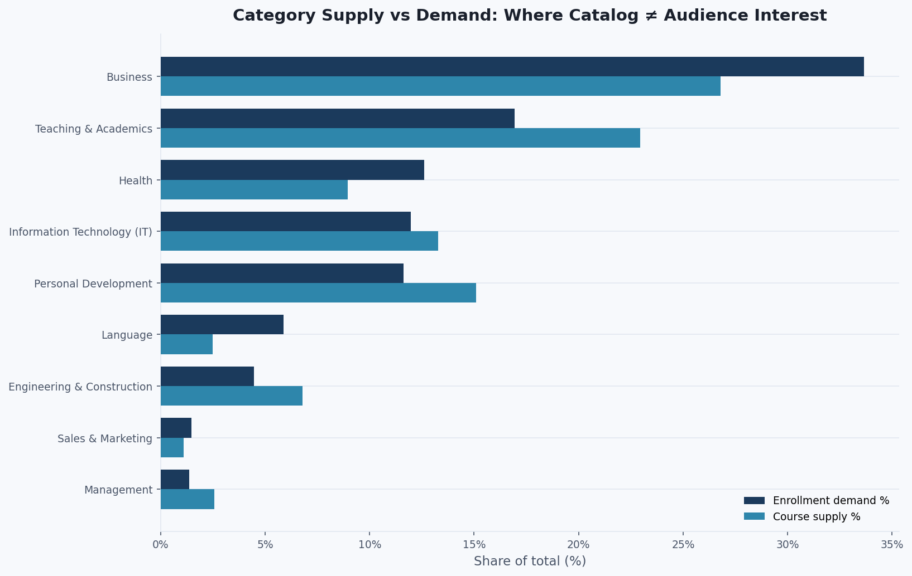

The clearest strategic misalignment is in the **Business** category: it accounts for 26.8% of all courses but attracts 33.7% of all enrollments — a 6.9 percentage-point demand gap that the current catalog is not filling. **Health** shows a similar undersupply pattern (+3.6pp).

On the other side, **Teaching & Academics** represents 23.0% of catalog supply but only 16.9% of enrollment demand — a 6-percentage-point oversupply. **Personal Development** is also overrepresented relative to learner interest.

> **Takeaway:** The platform is building where learners aren't going, and not building fast enough where they are.

---

## 2. Certification Conversion Gap

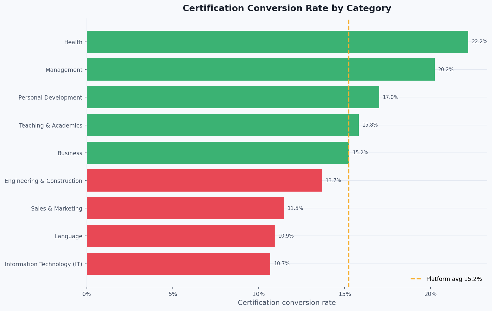

Across 9 categories, there is a **2x gap** between the highest and lowest certification rates:

| Category | Conversion Rate |
|---|---|
| Health | 22.2% |
| Management | 20.2% |
| Personal Development | 17.0% |
| Teaching & Academics | 15.8% |
| Business | 15.3% |
| Engineering & Construction | 13.7% |
| Sales & Marketing | 11.5% |
| Language | 10.9% |
| **Information Technology (IT)** | **10.7%** |

The platform average sits at **15.6%**. Health and Management courses are far more likely to result in certification, suggesting that learners arrive with clearer goals and motivation in these categories. IT courses — despite high enrollment — have the lowest completion rates, pointing to a content-fit or course-quality problem.

---

## 3. Publisher Performance

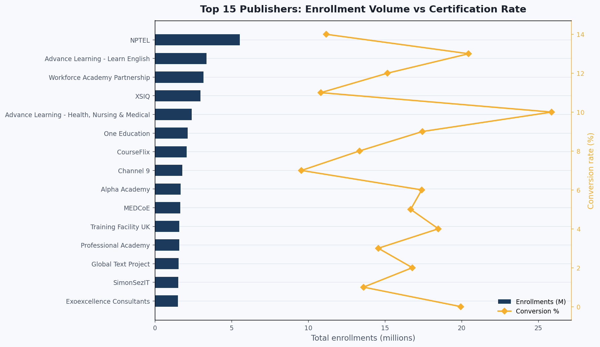

The top 5 publishers by enrollment volume tell a revealing story:

- **NPTEL** — 5.5M enrollments, but only 11.2% conversion. The largest publisher on the platform is well below average in learner completion.
- **Advance Learning – Learn English** — 3.4M enrollments, 20.4% conversion. Strong both in volume and outcomes.
- **Workforce Academy Partnership** — 3.2M enrollments, 15.2% conversion. Tracks close to platform average.
- **XSIQ** — 3.0M enrollments, 10.8% conversion. Another high-volume, low-conversion publisher.
- **Advance Learning – Health, Nursing & Medical** — 2.4M enrollments, **25.9% conversion** — the highest conversion rate of any major publisher.

This divergence matters: **volume and quality are not correlated.** The largest publishers are not the most effective at producing certified learners.

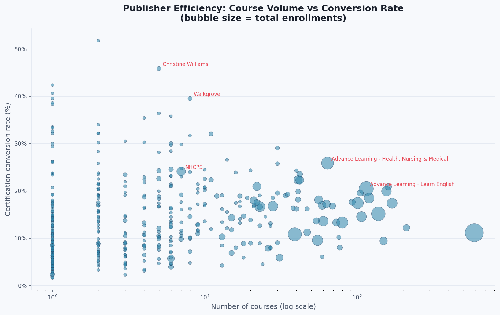

The scatter chart shows this clearly. Many publishers with modest course counts achieve far higher conversion rates than large-volume publishers. There is a cluster of high-efficiency, mid-size publishers whose practices could inform platform-wide quality standards.

---

## 4. The Drop-Off Crisis

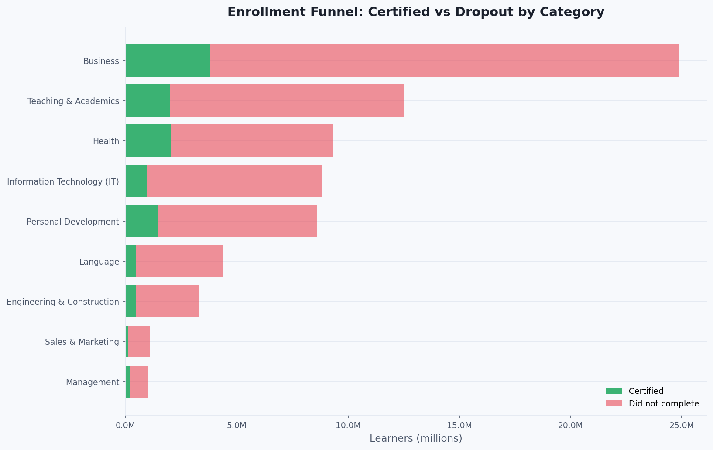

Across the platform, **84.4% of learners who enroll do not earn a certification**. At 73.9M total enrollments and only 11.5M certified, the scale of the drop-off is substantial. Business and Teaching & Academics, as the two largest categories by enrollment, account for the majority of absolute uncertified learners.

This is not simply a reflection of casual browsing — many of these courses are free and actively enrolled. The drop-off represents a real engagement failure, not just window shopping.

---

## 5. Course Difficulty Impact

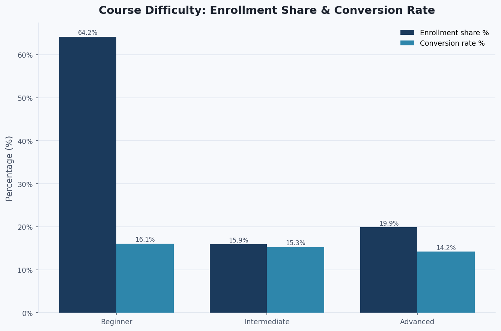

The platform is overwhelmingly beginner-oriented:

| Level | Enrollment Share | Conversion Rate | Courses |
|---|---|---|---|
| Beginner | 64.2% | 16.1% | 2,669 |
| Intermediate | 15.9% | 15.3% | 1,530 |
| Advanced | 19.9% | 14.2% | 1,535 |

Advanced courses draw a larger share of enrollments than intermediate courses — suggesting that learners who self-select into harder content are not casual browsers — but their conversion rate is the lowest of the three levels. This points to a difficulty calibration problem: advanced courses may be overestimating learner readiness, or not providing adequate scaffolding.

---

## 6. Format Matters: Video Is Not Better

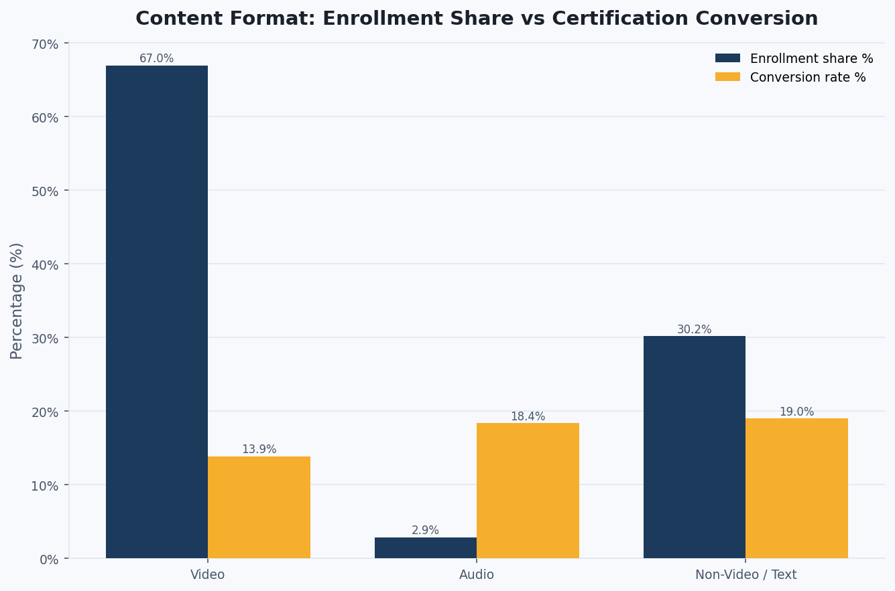

One of the most counterintuitive findings in this dataset: **video-based courses convert at the lowest rate**, while text-based and audio courses significantly outperform them:

| Format | Courses | Conversion Rate |
|---|---|---|
| Non-Video / Text | 1,385 | 19.0% |
| Audio | 84 | 18.4% |
| **Video** | **4,265** | **13.9%** |

Video dominates the catalog (74% of all courses) but underperforms text by 5+ percentage points. This likely reflects that video is used for longer, more complex courses — but it may also indicate that learner attention during passive video consumption is lower than during active text-based study. Either way, the platform's heavy investment in video production is not translating to proportionally better learner outcomes.

---

## 7. Skills in Demand

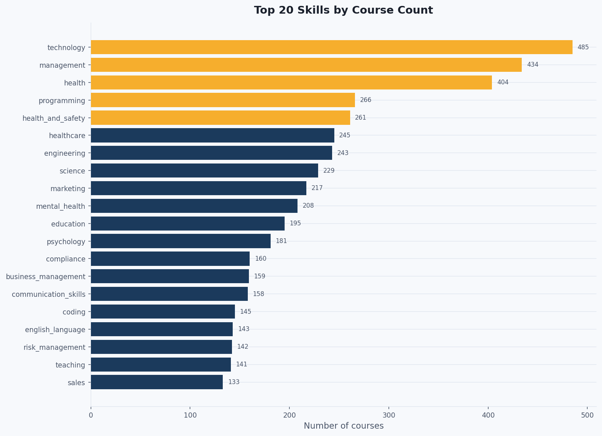

The top 20 skill tags by course count reveal what the platform considers its core content pillars. The five most-represented skills are:

1. **Technology** — 485 courses
2. **Management** — 434 courses
3. **Health** — 404 courses
4. **Programming** — 266 courses
5. **Health & Safety** — 261 courses

Healthcare-adjacent tags (health, healthcare, mental_health) collectively represent a substantial and growing proportion of the catalog, consistent with the supply-demand analysis showing health as an undersupplied but high-converting category.

---

## 8. The Broken Rating System

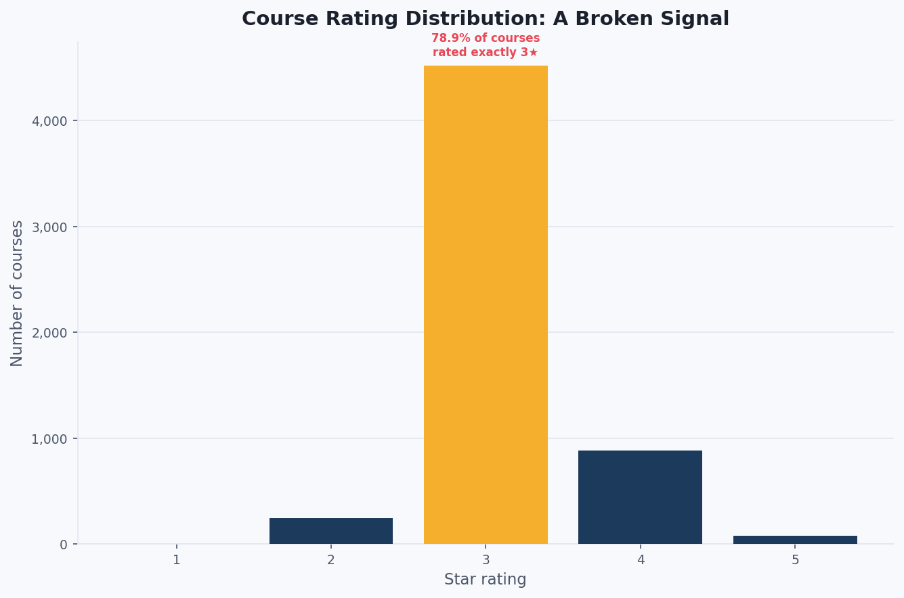

The course rating system is not functioning as a quality signal. Of all rated courses:

- **78.9%** are rated exactly **3 stars**
- 15.5% are rated 4 stars
- Only 1.3% receive 5 stars
- Less than 0.1% receive 1 star

This clustering around the midpoint is statistically implausible for a genuine quality distribution across 5,734+ courses. It suggests either systematic rating inflation, a default rating that is being assigned automatically, or a learner feedback loop that strongly anchors ratings at 3. In any case, **the rating system cannot be used to differentiate content quality** in its current form, which has downstream consequences for any recommendation or curation logic that relies on ratings.

---

## 9. The Premium Paradox

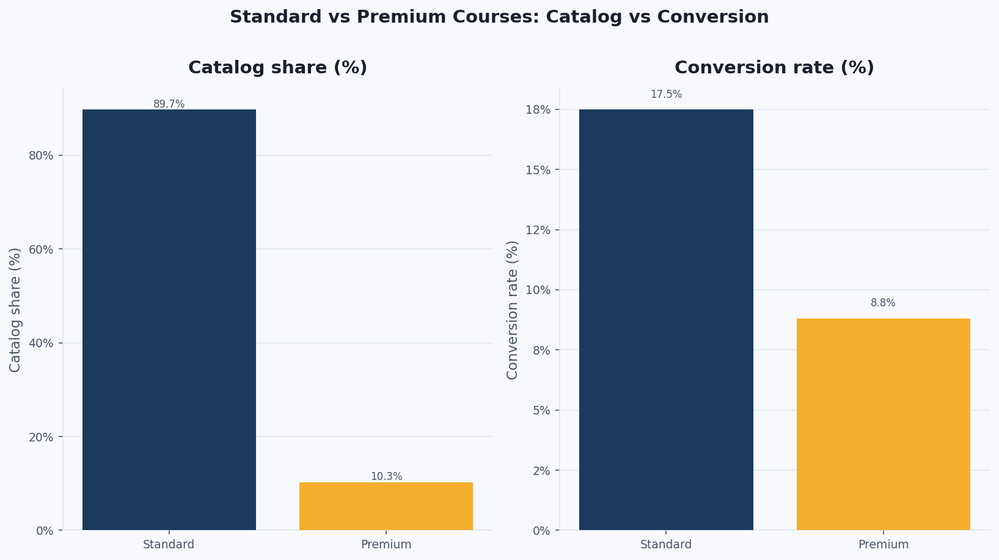

Premium courses make up just 10.3% of the catalog (589 courses) but attract significantly more enrollments on average: **27,832 vs 11,183** for standard courses. However, the conversion story reverses entirely:

| Type | Catalog Share | Avg Enrollments | Conversion Rate |
|---|---|---|---|
| Standard | 89.7% | 11,183 | **17.5%** |
| Premium | 10.3% | 27,832 | **8.8%** |

Premium courses bring in the crowds but lose them at nearly double the rate. Learners are attracted to premium branding but are not completing the courses. This may reflect higher expectations that courses fail to meet, longer or more complex course structures, or a mismatch between perceived and actual value.

---

## 10. Optimal Course Length

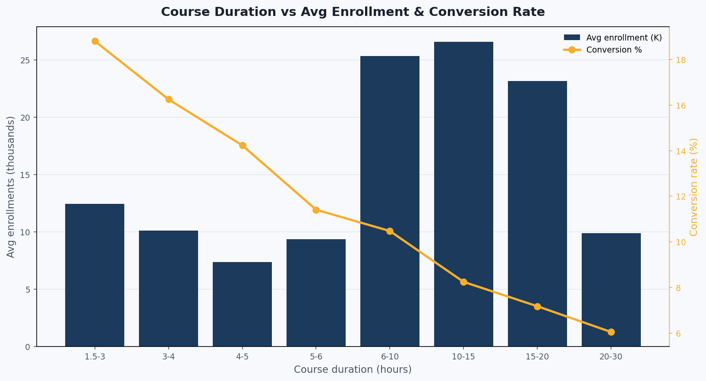

The relationship between course length and outcomes is clear and consistent: **shorter courses perform better on every metric**.

| Duration (hours) | Avg Enrollments | Conversion Rate |
|---|---|---|
| 1.5 – 3 | 12,431 | 18.8% |
| 3 – 4 | 10,105 | 16.3% |
| 4 – 5 | 7,386 | 14.2% |
| 5 – 6 | 9,351 | 11.4% |
| 6 – 10 | 25,325 | 10.5% |
| 10 – 15 | 26,585 | 8.2% |
| 15 – 20 | 23,156 | 7.2% |
| 20 – 30 | 9,898 | 6.0% |

The 1.5–3 hour band achieves the highest conversion rate (18.8%) and respectable average enrollment. Longer courses in the 6–15 hour range attract more total enrollments due to their prestige or depth, but conversion drops to nearly a third of the short-course rate by the time courses exceed 20 hours. The data supports a strong preference for **modular, bite-sized content** on this platform.

---

## 11. Learning Environments

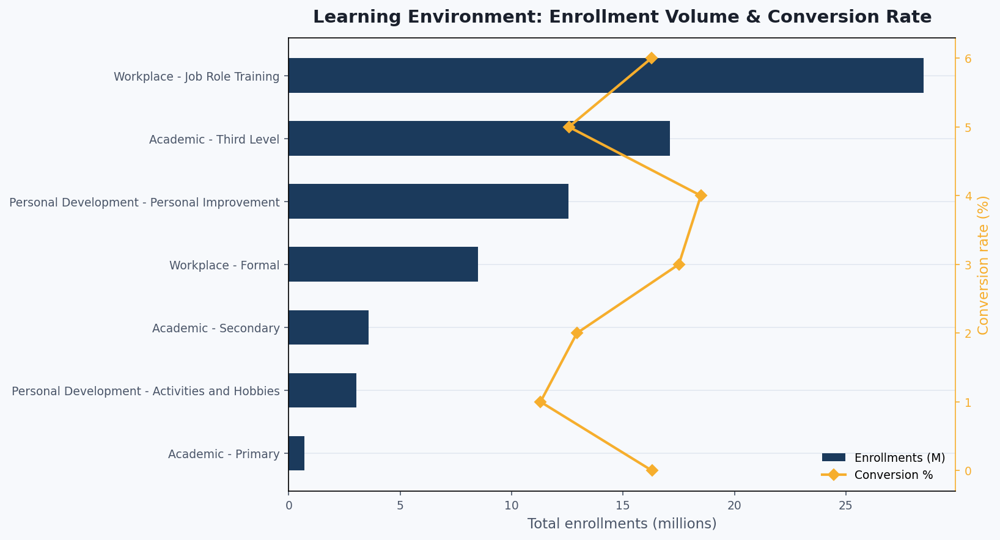

The platform's content is deployed across 7 learning environment types. By enrollment:

| Environment | Enrollments | Conversion Rate |
|---|---|---|
| Workplace – Job Role Training | 28.5M | 16.3% |
| Academic – Third Level | 17.1M | 12.6% |
| Personal Development – Improvement | 12.5M | 18.5% |
| Workplace – Formal | 8.5M | 17.5% |
| Academic – Secondary | 3.6M | 12.9% |
| Personal Development – Activities & Hobbies | 3.0M | 11.3% |
| Academic – Primary | 0.7M | 16.3% |

**Personal Development – Improvement** and **Workplace – Formal** achieve the highest conversion rates, while academic environments (secondary and university-level) underperform. Learners who come with practical workplace or self-improvement goals are more likely to see a course through to certification than those in formal academic contexts — where Alison may be a supplement rather than a primary credential path.

---

## 12. Strategic Recommendations

Based on the full analysis, seven prioritized actions for the platform:

**1. Rebalance catalog investment toward Business and Health.**
Both categories are structurally undersupplied relative to learner demand. Commission new content in these areas, prioritizing publishers who have demonstrated high conversion rates in Health (e.g., Advance Learning – Health, which converts at 25.9%).

**2. Overhaul the rating system before using it for recommendations.**
A system where 78.9% of courses share the same rating cannot differentiate quality. Introduce a behavioral signal (completion rate, return visits, learner time-on-task) to supplement or replace the current star rating.

**3. Investigate and address NPTEL's conversion gap.**
The platform's largest publisher by enrollment converts at only 11.2% — well below average. Understanding whether this is a structural issue (course format, length, difficulty), a content quality issue, or an audience mismatch is essential before further scaling the NPTEL relationship.

**4. Introduce a "Premium Course Guarantee" or redesign the premium experience.**
Premium courses attract nearly 2.5x more enrollments per course than standard courses, but convert at only 8.8% vs 17.5%. Either the courses are not living up to learner expectations, or their longer format is creating drop-off. A completion-focused redesign — with interim milestones, lighter modules, or active feedback loops — could significantly improve outcomes.

**5. Set a recommended course length ceiling of 5 hours.**
The data shows a consistent inverse relationship between length and completion. A platform design standard encouraging modular courses of 1.5–5 hours — with optional "advanced" continuations — would improve completion rates without reducing depth for learners who want it.

**6. Rethink the emphasis on video.**
Non-video (text-based) and audio courses outperform video by 5+ percentage points in conversion. This does not mean abandoning video, but the platform should audit long video-heavy courses for engagement patterns and explore hybrid formats that combine short video segments with active text-based assessments.

**7. Develop a publisher efficiency tier system.**
The scatter of publisher conversion rates (Chart 12) reveals a significant quality spread. Formalizing a publisher tier system — with conversion rate as a core metric — would allow the platform to provide differentiated support, surface high-performing smaller publishers, and set minimum quality thresholds for continued catalog listing.

---

## Chart Index

| # | Chart | Key Finding |
|---|---|---|
| 01 | Category Supply vs Demand | Business undersupplied by 6.9pp; Teaching & Academics oversupplied by 6.0pp |
| 02 | Conversion by Category | Health (22.2%) leads; IT (10.7%) trails — a 2x gap |
| 03 | Top Publishers | NPTEL volume ≠ quality; Advance Learning Health is the efficiency leader |
| 04 | Enrollment Funnel | 84.4% of learners do not certify across all categories |
| 05 | Level Performance | Beginner captures 64.2% of enrollments; Advanced has lowest conversion |
| 06 | Content Format | Video (13.9%) underperforms text (19.0%) by 5+ percentage points |
| 07 | Skills Demand | Technology, Management, and Health dominate skill representation |
| 08 | Rating Distribution | 78.9% of courses rated 3 stars — system is not a usable quality signal |
| 09 | Standard vs Premium | Premium draws more learners but converts at half the rate of Standard |
| 10 | Duration vs Performance | 1.5–3 hour courses peak at 18.8% conversion; 20–30h falls to 6.0% |
| 11 | Environment Breakdown | Personal Development leads conversion (18.5%); Academic trails |
| 12 | Publisher Efficiency | Mid-size publishers dominate efficiency; scale does not predict quality |

---

*Analysis based on Alison.com course catalog data: 5,734 courses · 73.9M enrollments · 11.5M certifications · 446 publishers · 9 categories.*
